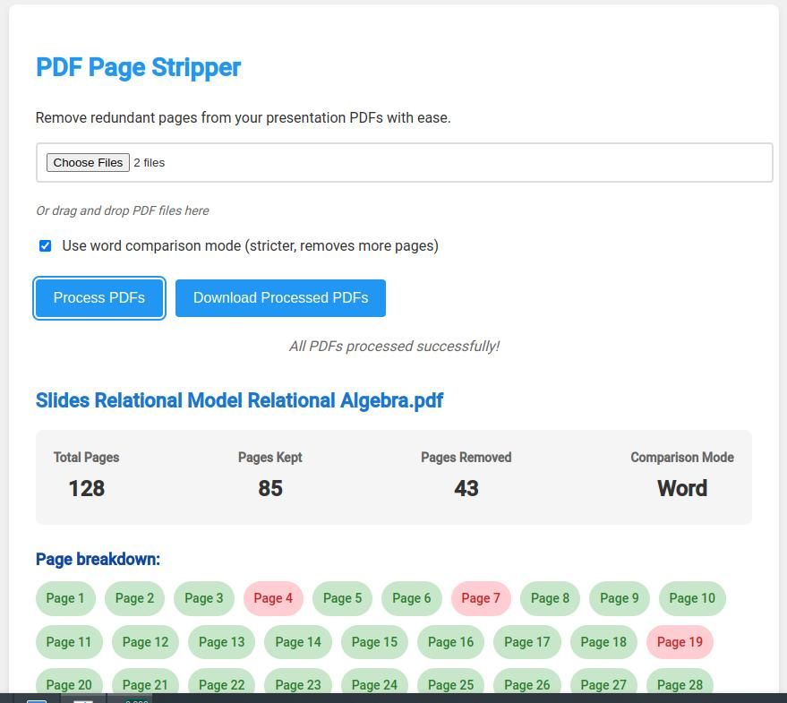

# PDF Page Stripper (Presentation Slides)

**PDF Page Stripper** removes pages that are considered redundant, particularly useful for cleaning up presentations or documents where slides/pages incrementally build on the previous ones. 

Live Demo: [PDF Page Stripper (Presentation Slides)](https://persie0.github.io/PDF-Page-Stripper/)

## How to Use

1. Open the [web app](https://persie0.github.io/PDF-Page-Stripper/).
2. Select one or more PDF files by clicking on the file input.
3. Choose the comparison mode:
    - Word comparison mode (default): Strips more pages by comparing individual words.
    - Full text comparison mode: Strips fewer pages by comparing the entire text content.
4. Click "Process PDFs" to start analyzing the documents.
5. After processing, a "Download Processed PDFs" button will appear. Click it to download a ZIP file containing the cleaned PDFs.

## How It Works

1. **Upload PDF Files**: You can upload one or more PDF files using the file input field.
2. **Comparison Mode**: Choose between word comparison (strips more) and full text comparison (strips less).
3. **Page Comparison**: The tool extracts content from each page and compares it to the previous page. If the current page contains all the content from the previous page (based on the chosen comparison mode), the previous page is considered redundant and is removed.
4. **Download Processed PDFs**: After processing, you can download the modified PDFs, which only retain the relevant pages. The result is available as a downloadable ZIP file containing all processed PDFs.

## Features

- **Multi-file support**: You can upload multiple PDF files at once, and each will be processed individually.
- **Text-based analysis**: The comparison is based purely on the text content of each page.
- **Results Summary**: For each PDF, the tool provides a breakdown of total pages, pages kept (green), and pages removed (red), along with a visual representation of the page retention.

### Idea and Inspiration

This project was inspired by [pdf-page-stripper](https://github.com/fsinf/pdf-page-stripper) on GitHub. But for me, the original often works "too good" and removes more than it should.
